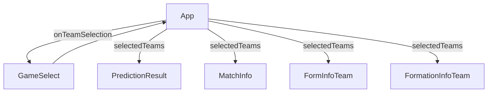

# React frontend components overview

### Components

Our frontend consists of components for selecting the teams, showing the prediction result and for showing additional info on each team. All of the components are in the App component, which also handles the state for the selected teams so that all the other components can use this state to display the results of the prediction and information about each team.



### Data fetching

The components for the prediction result and the team information use our backend api or a public soccer api to get the results and show them. The api requests should be made in a useEffect hook with the teams as dependency so that they only refetch when teh teams passed in as props change. Also we want to have information about the loading and error state for our request.

So our fetching would likely look something like this (maybe we should use a library like React SWR or even better maybe react-query):

```javascript
// State
const [prediction, setPrediction] = useState(null);
const [isLoading, setIsLoading] = useState(false);
const [error, setError] = useState(null);
...
useEffect(() => {
async function fetchPrediction() {
try {
setIsLoading(true);
setError(null); // Reset the error state
// Check if both teams are selected
// Fetch prediction from the API
setPrediction(data.prediction);
// Reset prediction if teams are not selected
setPrediction(null);
} catch (error) {
console.error('Error fetching prediction:', error);
setError('Failed to fetch prediction');
} finally {
setIsLoading(false);
}
 };
fetchPrediction();
}, [selectedTeams]);
...
```

With React-Query this becomes much more easy by simply using the prop as query key and we also get the loading and error information fro free.

### Icons 

When working with Icons we use the React-Icons library that provides many icons and is easy to use. The icons can be viewed here: https://react-icons.github.io/react-icons/.


